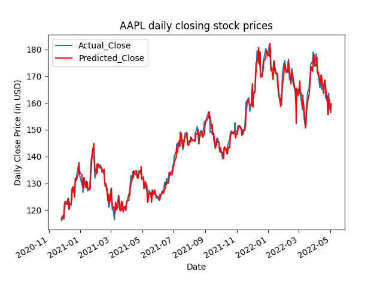

# Stock-market-prediction-using-HMM-Model
# Dependencies
* Pandas_datareader - Allows one to download data directly from Yahoo finance
* NumPy - Required for fast manipulation of financial data (e.g. calculating fractional change)
* Matplotlib - Required for visualisation of results
* Hmmlearn - Open source package that allows for creation and fitting of HMM's 
* Sklearn - Used to calculate metrics to score the results and split the data, will be removed in future to reduce dependency
* Tqdm - Used to track progress whilst training
* Argparse - Required for console inputs
# Working in terminal

# Output

